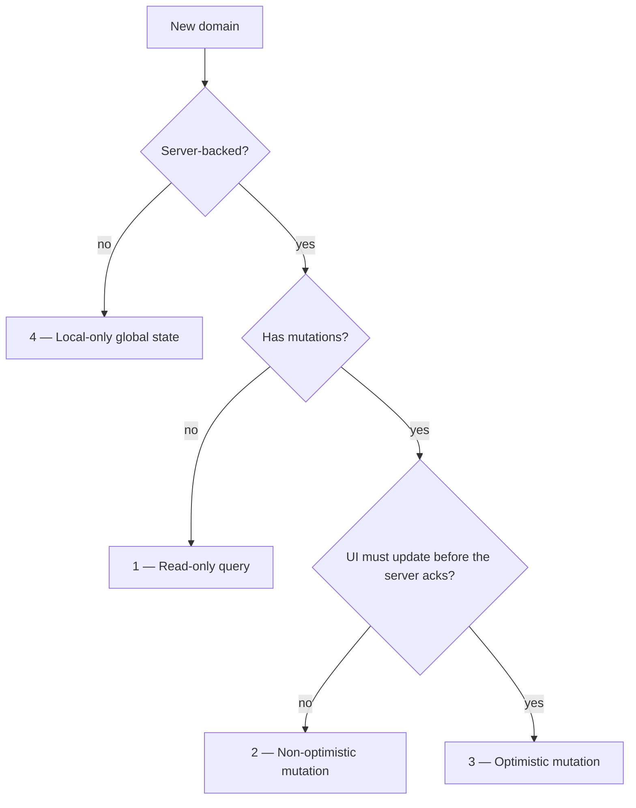
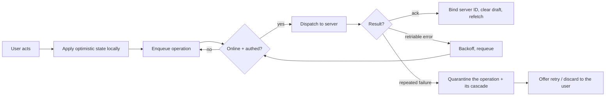

# Data-layer scenarios

The cases the client data layer must cover, independent of implementation. Use this as the checklist a stack (Redux + TQ, TanStack DB + TQ, or anything else) must satisfy before it can back a domain. For the concrete head-to-head of the two stacks in this repo, see [Redux vs TanStack DB](./redux-vs-tanstack-db.md).

## The four data shapes

Every domain falls into one of four shapes. Pick the shape first; the mutation requirements below only apply to shapes 3 and 4.

| # | Shape | Reads | Writes | Server round-trip | Optimistic |
|---|---|---|---|---|---|
| 1 | Read-only query | server | — | on read | — |
| 2 | Non-optimistic mutation | server | server | on read + write | no |
| 3 | Optimistic mutation | server | server | on read + write | **yes** |
| 4 | Local-only global state | local | local | never | n/a (local is the source of truth) |

### 1. Read-only query

Fetch server data, cache it, show it. No writes.

Must cover:
- **Loading / error / empty states** distinguishable at the consumer.
- **Staleness policy** — when a cached value is considered fresh vs needing refetch.
- **Refetch triggers** — mount, window focus, reconnect, manual.
- **Type safety** end-to-end from the wire to the component.

Examples: current user, static config, content screens.

### 2. Non-optimistic mutation

Fetch + write, but the UI waits for the server before reflecting the change. No optimistic state, so no rollback, no queue.

Must cover everything in (1), plus:
- **In-flight state** at the consumer (`isUpdating`) so the UI can disable / spinner.
- **Refetch-after-mutate** — invalidate or refetch the affected query once the write acks.
- **Error surfacing** — a failed write reports back; nothing local to undo.

Examples: accepting a consent, submitting a form where a brief wait is acceptable.

### 3. Optimistic mutation

The hard case. The UI reflects the change immediately, before (or without) a server round-trip, then reconciles. This is where the bulk of the requirements live — see **Optimistic mutation requirements** below.

Examples: toggling a todo, reordering a list, anything that must feel instant offline.

### 4. Local-only global state

State that lives only on the device and is the source of truth — never fetched, never pushed. Reads and writes are both local and synchronous.

Must cover:
- **Read** via a composable selector / query.
- **Update** via a dispatched action / write.
- **Persistence** across app restarts (with an explicit whitelist of what persists).
- **Derived/computed views** (e.g. effective locale = debug override ?? user locale).

Examples: locale + debug-locale override, feature flags, UI preferences.

> A single global object (one row) is the natural fit for a slice/store, **not** a collection of rows. Don't force local-only singletons into a row-keyed collection model.

## Optimistic mutation requirements

Everything below applies to **shape 3**. These are the lifecycle obligations a stack must meet to be correct — not nice-to-haves. They are ordered from "happy path" outward to "adversarial".

### Happy path

- **Immediate local apply** — the change is visible on the next render, no server wait.
- **Operation queue** — the write is recorded as a durable, ordered operation, not a fire-and-forget call.
- **Server dispatch** when online + authenticated; the queue drains in order.
- **Ack reconciliation** — on success, replace optimistic state with server truth and refetch the affected queries.

### Temp IDs (create before the server assigns one)

- **Optimistic insert** gets a client-generated temp ID so it can render and be referenced immediately.
- **ID reconciliation** — when the server returns the real ID, bind temp → server ID so subsequent operations target the right row.
- **Crash-safe binding** — the temp→server mapping survives a reload mid-flight (persisted, keyed by a stable correlation key).
- **Render-key alias** — the UI keys off a stable alias so a temp row doesn't unmount/remount when its ID flips to the server value. Temp IDs never leak to the consumer.

### Rollback without losing concurrent local edits

On a failed (non-retriable) write, undo *that operation's* optimistic effect **without** discarding unrelated local state the user has since changed.

- Rollback is scoped to the failed operation, not a blanket revert of the view.
- Concurrent edits to other rows/fields made after the optimistic apply must survive.
- The merged view recomputes from current local state + remaining queued ops, so removing one op cleanly drops just its contribution.

### Side effects on separate collections

A single mutation often must write to more than one collection (e.g. toggling a todo also appends an audit-log entry).

- **One operation, multiple projections** — the mutation declares its effect on each affected collection.
- Each projection has its own **optimistic apply**, **on-success** (default: refetch), and **on-error** (default: clear) behavior.
- Projections roll back / quarantine **together** with their parent operation — they never desync.

### Retry + persistent exponential backoff

- **Retriable vs non-retriable** — each operation declares whether it is safe to retry (`retrySafe`). Non-idempotent writes opt out.
- **Exponential backoff** — `min(2^retry × base, cap)` per operation, so a failing op doesn't hammer the server.
- **Persisted schedule** — `nextAttemptAt` survives reload; an op with 25s remaining still waits 25s after a restart, it doesn't reset or fire immediately.
- **Runtime wake-up** — a timer fires the queue when the earliest pending op comes due.

### Quarantine after repeated failure

After N failed attempts, an operation is moved out of the active queue into a quarantine area so it stops blocking the drain and stops retrying.

- **Quarantine boundary** — quarantined ops are visible and inspectable, separate from the live queue.
- **Cascade quarantine** — operations sharing a correlation key (e.g. create → toggle → toggle on the same row) quarantine as a group. You can't strand a child op whose parent never landed.
- **User recovery actions** on the cascade:
  - **Retry cascade** — requeue the whole group.
  - **Discard cascade** — drop the whole group, rolling back its optimistic state.
  - **Discard anchor + requeue rest** — drop the failing head op but retry the dependents (e.g. the create failed but the edits are still wanted against an existing row).

### Online / auth transitions

- **Drain on reconnect** — coming back online drains the queue.
- **Drain on auth flip** — logging in (or token refresh) drains queued ops that needed auth.
- **Single drain mutex** — concurrent triggers (focus + reconnect + auth) don't double-dispatch the same op.
- **Refetch on reconnect** — stale queries refetch when connectivity returns, in parity with the optimistic reconciliation.

### Crash / cold-boot recovery

- **Cold-boot sweep** — on init, re-evaluate the persisted queue: resume in-flight ops, re-arm backoff timers, sweep anything that should already be quarantined.
- **Crash-vs-in-flight disambiguation** — distinguish "this op is actively sending in *this* session" from "this op was persisted mid-flight by a previous session that crashed," so the UI can show *Sending…* vs *Recovered after crash* correctly.

## Deduplication (idempotent at-least-once delivery)

The runner gives at-least-once delivery: an op may dispatch more than once if the BFF ran the work but the response never reached the client. Without dedup, retries can double-write (a `createTodo` lands twice, an `incrementBudget` adds twice). The contract the queue needs from the server:

- **Stable op id, client-minted.** Each queued op gets a UUID at enqueue time and keeps it across retries. The FE sends it as the `X-Client-Op-Id` header on every mutation request, so a retry carries the same id as the original attempt.
- **Server-side dedup store.** First execution persists `(clientOpId, response)`; subsequent requests with the same id return the cached response without re-running the resolver. Closes the gap when the response was lost in transit.
- **Per-call ids on fan-out.** Some queued ops produce multiple HTTP calls (e.g. shopping-list `syncItems` adds N items, removes M, updates K). Each derived call needs its own id (`${parentOpId}:add:${itemId}`, etc.) — deterministic across retries, but distinct per HTTP request so the cache doesn't collide.
- **Optional opt-out.** When the header is missing the server falls through to plain execution. Reads never carry the header. Mutations made outside the durable queue (manual GraphQL playground calls, admin tooling) are unaffected.
- **Cache durability.** The dedup store survives BFF restarts. If the cache forgets between attempts, the next retry re-runs the work — back to the original at-least-once risk.
- **Replay fidelity.** A replayed response must match the original byte-for-byte after GraphQL serialization. ISO-8601 strings round-tripped through JSON need to come back as `Date` instances (or whatever the scalar's `serialize` expects), or the second response 500s on a serialization error.

## Coverage checklist

A stack is ready to back an optimistic domain only when every box is satisfiable:

- [ ] Immediate local apply + durable ordered queue
- [ ] Ack reconciliation + refetch
- [ ] Temp ID generation, crash-safe reconciliation, render-key alias
- [ ] Scoped rollback that preserves concurrent local edits
- [ ] Multi-collection projections that roll back / quarantine atomically
- [ ] Per-op `retrySafe` flag honored
- [ ] Persistent exponential backoff with reload-safe schedule
- [ ] Quarantine boundary + cascade grouping by correlation key
- [ ] Retry / discard / discard-anchor-requeue-rest recovery actions
- [ ] Drain on reconnect + auth flip behind a single mutex
- [ ] Cold-boot sweep + crash-vs-in-flight disambiguation

## Related

- [Redux vs TanStack DB](./redux-vs-tanstack-db.md) — how the two stacks in this repo each satisfy these scenarios, scored side by side.
- [Client API Integration](./client-api-integration.md) — the concrete data layer between React components and the BFF.
- [API Library](./api-library.md) — the TanStack Query + Redux hybrid that implements shapes 1–4 today.
